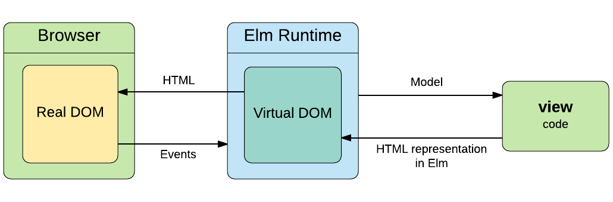

import { CodeSurfer } from 'mdx-deck-code-surfer';
import { Appear, Notes, Image } from 'mdx-deck';
import { Listed, Fronted, BackgroundImaged } from './layouts';
import { codeSurferTitle, Ul, Li, MetaList, ImageText } from './components';
import './init';
export { theme } from './themes/lundegaard';

# Stručný úvod do Elm

## 💙 _&lambda;_

- Tomáš Konrády
- <a href="https://twitter.com/konnnyy">@konnnyy</a>
- Minipřednášky

<a href="https://lundegaard.eu">Lundegaard a. s.</a>

export default Fronted;

---

## Seriál - Stručný úvod do FP jazyků

- Stručný úvod do Elm
- Lehký úvod do ReasonML
- Lehký úvod do Elixir
- Clojure(Script) to rule them all!

export default Listed;

---

<Image src="images/evolution.jpg" size="contain" />

export default BackgroundImaged;

---

<Image src="images/helloworld.jpg" size="contain" />

export default BackgroundImaged;

---

<Image src="images/elm.png" size="3%" css={{ opacity: 0.6, backgroundRepeat: 'repeat' }} />

# Elm

A **delightful** language for reliable webapps.

export default BackgroundImaged;

---

<a href="https://twitter.com/czaplic">
	
</a>

---

## Features

- Main platform is a Web Browser
- Compiled to JS
- FP: Immutable, Static Types, no side-effects, ...
- Type inference
- Elm Architecture

export default Listed;

---

# No runtime exceptions

```notes
neznamená program bez chyb
```

---

## Mac

```sh
brew install elm
brew install elm-format
brew install elm-oracle
```

```notes
elm - cli tools
elm-format - prettier pro elm
elm-oracle - používá většina IDE pro support Elmu
```
---

## Mac & Win

```sh
nvm use v9.0.0
yarn global add elm elm-format elm-oracle
```
---

<Image size="contain" src="images/elm-compiler.png" />

---

<CodeSurfer
	title={codeSurferTitle('Ukázka Elmu')}
	lang="elm"
	code={require('raw-loader!./snippets/1.snippet')}
/>

---

## Elm subcommands

```sh
elm repl
elm reactor
elm init
elm make
elm-package
```
<Appear>
	Ukázka #1
</Appear>

```notes
repl:

foo = "Hello "

bar = "Lunde"

foo ++ bar

reactor:

elm init

elm reactor


```

---

## Build
```
elm make src/Main.elm --output=dist/app.js
```
---

## Add package
```
elm-package install NoRedInc/elm-string-extra

```
---
[package.elm-lang.org](https://package.elm-lang.org/)
---

<CodeSurfer
	title={codeSurferTitle('Basic types')}
	lang="elm"
	code={require('raw-loader!./snippets/2.elm')}
	steps={[
		{ range: [1, 4] },
		{ range: [6, 9] },
		{ range: [11, 12] },
		{ range: [14, 16] },
	]}
/>

---

## Funkce

Ukázka #2

---

<CodeSurfer
	lang="elm"
	title={codeSurferTitle('Funkce')}
	code={require('raw-loader!./snippets/fns.elm')}
/>

---

## Records

Ukázka #3

---

<CodeSurfer
	lang="elm"
	title={codeSurferTitle('Records - update')}
	code={require('raw-loader!./snippets/records.elm')}
/>

---

# Lens

## [Monocle.Lens](https://package.elm-lang.org/packages/arturopala/elm-monocle/2.1.0/Monocle-Lens)

---
# List

Ukázka #4 - Map, Filter, Reduce
---

<CodeSurfer
	lang="elm"
	title={codeSurferTitle('if-else expression')}
	code={require('raw-loader!./snippets/ifelse.elm')}
/>

---

<CodeSurfer
	lang="elm"
	title={codeSurferTitle('let expression')}
	code={require('raw-loader!./snippets/let.elm')}
/>

---

<CodeSurfer
	lang="elm"
	title={codeSurferTitle('Html')}
	code={require('raw-loader!./snippets/html.elm')}
/>

---

## Virtual Dom



---

## Elm architecture


---

Ukázka #5 - Elm architecture

```notes
vytvořeno create-elm-app
elm-app start

```

## Jak vytvořit realworld aplikaci?

- [elm-spa-example](https://github.com/rtfeldman/elm-spa-example)
- [create-elm-app](https://github.com/halfzebra/create-elm-app)
- [elm-webpack-starter](https://github.com/elm-community/elm-webpack-starter)

---

## Zdroje

- [Official guide](https://guide.elm-lang.org/)
- [Beggining Elm](https://elmprogramming.com/)

---
